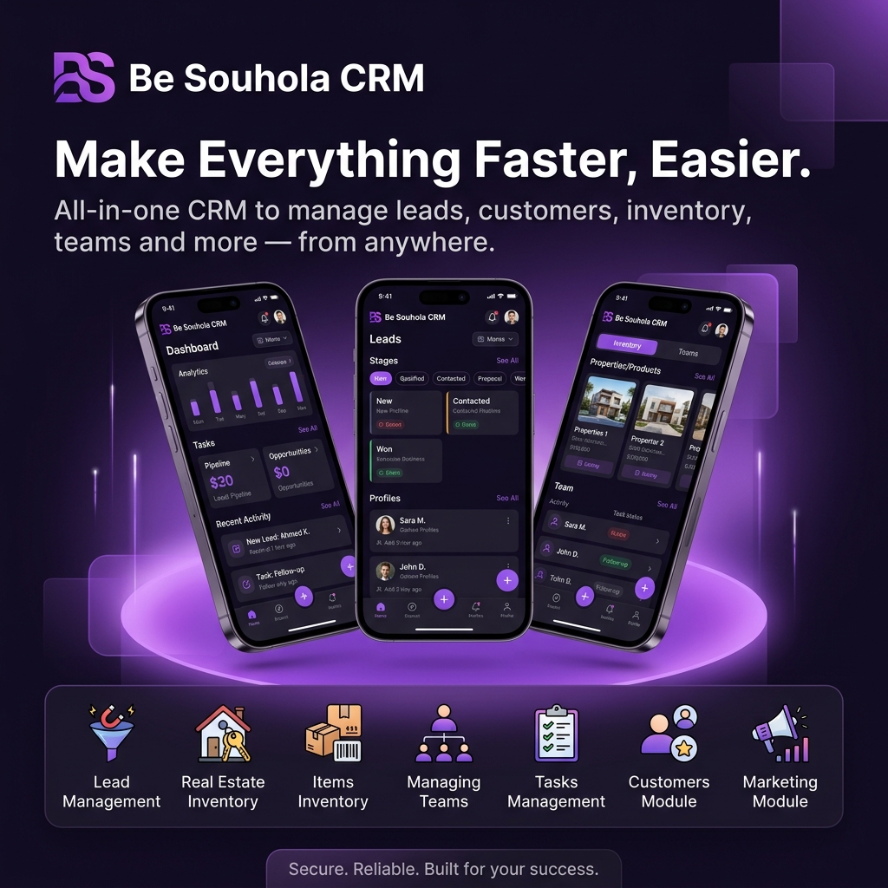

<div align="center">



<br/>

# Be Souhola CRM — Mobile Application

### All-in-one CRM to manage leads, customers, inventory, teams and more — from anywhere.

<br/>

[](https://flutter.dev)
[](https://dart.dev)
[](https://firebase.google.com)
[](https://flutter.dev)
[](https://blog.cleancoder.com)
[](.)

<br/>

> 🎬 **[▶ Watch Full Demo Video](https://drive.google.com/file/d/16rBHMOWudrHWlk5x1i1j8xQ0MlOIHplX/view?usp=drive_link)**

<br/>

</div>

---

> ⚠️ **Note on Source Code**
> The source code for this project is **not publicly available** due to client confidentiality policies. This repository serves as a **portfolio showcase** of the application's features, architecture, and technical capabilities.

---

## 📌 Overview

**Be Souhola CRM** is a production-grade, **multi-tenant SaaS CRM mobile application** built entirely with **Flutter & Dart**. It serves two distinct business verticals — **Real Estate agencies** and **General Sales organizations** — each with a tailored experience under the same codebase.

The system supports complete sales lifecycle management: from lead capture and pipeline tracking, through customer relations, inventory, marketing campaigns, and task management — all secured by a granular role-based access control system and available in both **Arabic and English** with full RTL support.

---

## 🎬 Demo

> **[▶ Click here to watch the full app demo](https://drive.google.com/file/d/16rBHMOWudrHWlk5x1i1j8xQ0MlOIHplX/view?usp=drive_link)**

---

## 🛠️ Technology Stack

| Layer | Technologies |
|---|---|
| **Framework** | Flutter (Dart SDK ^3.10) — Android, iOS, Web, Windows |
| **State Management** | Provider — `ChangeNotifier`, `MultiProvider` (18+ providers) |
| **Architecture** | Clean Architecture (Presentation → Business Logic → Repository → Data Model) |
| **HTTP Client** | Dio — REST API, Bearer Token Auth, Multipart File Upload |
| **Push Notifications** | Firebase Cloud Messaging (FCM) + `flutter_local_notifications` |
| **Authentication** | JWT, 2FA, Multi-tenant Subdomain Routing, SharedPreferences |
| **Localization** | Arabic / English bilingual, RTL/LTR, `flutter_localization`, `intl` |
| **Location** | `geolocator` — GPS field visit check-in/check-out |
| **Communication** | WhatsApp Business API + Email API (send/receive, templates) |
| **File Handling** | `file_picker`, `image_picker` — document and image attachments |
| **PDF & Sharing** | `pdf`, `printing`, `share_plus` — export and share reports |
| **UI & Theming** | Google Fonts (Inter + Cairo), `flutter_screenutil`, Dark/Light themes |
| **Device** | `device_info_plus` — FCM token registration per device |
| **URL & Phone** | `url_launcher` — one-tap phone calls and external links |

---

## 📦 Modules

### 🔐 1. Authentication & Multi-Tenant Access
- Subdomain-based company login — each tenant has its own isolated environment
- JWT Bearer Token authentication with `SharedPreferences` persistence
- Two-Factor Authentication (2FA) support
- Per-module permission loading on login
- Role-based UI rendering — 15+ distinct user roles supported

---

### 🏠 2. Home Dashboard
- **Real-time KPIs** — total leads, new leads, converted, cancelled, delayed counts
- **Pipeline Stage Cards** — visual lead funnel with expand/collapse
- **Top Agents Leaderboard** — All-time / Today / Week / Month tabs with conversion rates
- **Delayed Leads Panel** — overdue leads surfaced automatically with smart suppression
- **Activity Feeds** — recent comments and phone call logs across the team
- **Dashboard Filters** — filter by manager, employee, and custom date range
- **Smart Refresh Cooldown** — prevents redundant API calls during tab switching

---

### 👥 3. Lead Management
- Full lead CRUD — create, view, edit, soft-delete, restore
- **Pipeline Stage Management** — configurable stages with transition dialogs
- **Advanced Filtering & Search** — by stage, source, campaign, agent, date range
- **Infinite Scroll Pagination** — server-side paginated lead list
- **Action Timeline** — log calls, meetings, comments, follow-ups, visits
- **Attachment Management** — upload, view, delete documents and images per lead
- **WhatsApp & Email Messaging** — send messages and templates directly from lead profile
- **Duplicate Detection** — warn, compare side-by-side, and resolve duplicates
- **Bulk Operations** — bulk assign, status change, delete, restore, import, referral
- **Lead Transfer** — reassign lead ownership across agents/managers
- **GPS Visit Log** — field agents check in/out with geolocation
- **Recycle Bin** — soft-deleted leads recoverable from the bin
- **Referral System** — referral leads, referral stats, referral supervisor routing
- **Custom Field Values** — per-tenant dynamic metadata on every lead

---

### 📋 4. Task Management
- Task CRUD with full status workflow: Pending → In Progress → Done / Cancelled
- Priority levels: Low, Medium, High, Urgent
- Assignment to team members with department scoping
- Due date, start date, and progress percentage tracking
- Filtering by status, priority, assigned user, and related entity
- Linked to leads, customers, or any CRM entity

---

### 📣 5. Marketing Module
- **Campaign Management** — create, track, activate, pause, and close campaigns
- **KPI Tracking** — spend, revenue, and leads per campaign
- **Lead Source Management** — manage and attribute lead sources
- Campaign status filtering: Active / Inactive / Paused

---

### 🧑‍💼 6. Customer (CRM) Module
- Full customer profile management
- **Quotation Management** — create and track quotations per customer
- **Sales Order Management** — full order lifecycle management
- Three-tab layout: Customers / Quotations / Sales Orders
- Customer interaction history: comments, calls, visits

---

### 🏗️ 7. Inventory Module

#### Real Estate Inventory
- **Properties** — list, filter, multi-step property wizard for creation
- **Projects** — manage real estate projects linked to properties
- **Developers** — developer profiles and management
- **Brokers** — broker profiles and assignment management

#### General Inventory
- **Items** — create, view, edit, delete inventory items
- **Categories** — organize items into structured categories
- **Labels** — tagging and classification system

---

### 🔔 8. Push Notifications
- Firebase FCM — foreground, background, and terminated-app state handling
- **Deep-link Navigation** — tap a notification → navigate directly to the relevant lead or task
- FCM token auto-registration and refresh per device
- **In-App Notification Center** — notification history accessible from the top bar
- High-importance Android notification channel for guaranteed delivery

---

### 🤖 9. AI ChatBot
- Glassmorphism-styled conversational chat interface
- File and image attachment support within chat
- Theme-aware (adapts to Dark / Light mode)

---

### 🌍 10. Localization & Theming
- **Full Arabic / English** bilingual support with dynamic RTL/LTR switching
- **Cairo font** for Arabic, **Inter font** for English
- **Dark & Light themes** — user-persisted preference
- All strings translated across every module

---

## 🏛️ Architecture

```
lib/
├── AIChatBot/              # AI Chat screen
├── API Service/            # Dio clients & API endpoint constants
├── Business Logic/
│   ├── Models/             # Domain models (Inventory etc.)
│   └── Provider/           # 18+ ChangeNotifier state providers
├── Constants/              # App drawer, navbar, splash, helpers
├── Data Models/            # API response models (Auth, Leads, Tasks, CRM...)
├── Data Repositories/      # Repository layer — all API calls
├── Presentations/
│   ├── General Widgets/    # Shared reusable widgets
│   └── Screens/            # Feature screens (Auth, Dashboard, Leads, Tasks...)
└── l10n/                   # Localization strings (EN + AR)
```

**Design Patterns:**
- ✅ Clean Architecture (4-layer separation)
- ✅ Repository Pattern (one repo per feature domain)
- ✅ Provider Pattern (ChangeNotifier + MultiProvider)
- ✅ Role-Based Access Control (RBAC)
- ✅ Multi-Tenant SaaS (subdomain routing)
- ✅ State Reset on Logout (no data leaks between sessions)

---

## 🔒 Role-Based Access Control

The application supports **15+ distinct user roles** with granular permission control over every UI element and API action:

| Role Category | Roles |
|---|---|
| **Admin** | Admin, Super Admin |
| **Sales** | Sales Person, Sales Manager, Sales Admin, Team Leader |
| **Management** | Director, Operation Manager, Branch Manager |
| **Customer** | Customer Agent, Customer Manager, Customer Team Leader |
| **Marketing** | Marketing Moderator, Marketing Manager |
| **Support** | Support Agent, Support Manager |

---

## ✨ Key Technical Highlights

- 🔗 **30+ REST API endpoints** integrated via Dio with token interceptors and safe null parsers
- 📲 **FCM push notifications** working in all 3 app lifecycle states with payload-based deep linking
- 📊 **Real-time dashboard** with 9 parallel API calls, refresh cooldown, and per-operation loading states
- 🔄 **Bulk operations** on leads — up to 5 bulk action types including import, assign, and force-delete
- 🔍 **Duplicate lead engine** — server-side detection with client-side side-by-side comparison UI
- 📍 **GPS field visits** — agents log geo-tagged check-in/out directly from the lead profile
- 📄 **PDF report generation** — exportable reports and quotations using the `pdf` package
- 🌍 **Bilingual RTL/LTR** — complete UI flip with locale-aware fonts, all strings translated
- 🔐 **RBAC at UI level** — every button, tab, and action conditionally rendered based on user role and module permission
- 🧹 **Clean session handling** — all 18 providers expose `reset()` called on logout to prevent data leaks

---

## 📱 Screenshots

> 🎬 **[Watch the full demo video for a complete walkthrough →](https://drive.google.com/file/d/16rBHMOWudrHWlk5x1i1j8xQ0MlOIHplX/view?usp=drive_link)**

---

## 👨‍💻 Developer

**Mostafa Samiro** — Flutter Mobile Developer

[](https://linkedin.com/in/mostafa-samiro)
[](https://github.com/MostafaSamiro)

---

<div align="center">

**⭐ If you found this project impressive, please star the repository!**

*Built with ❤️ using Flutter — Secure. Reliable. Built for your success.*

</div>
